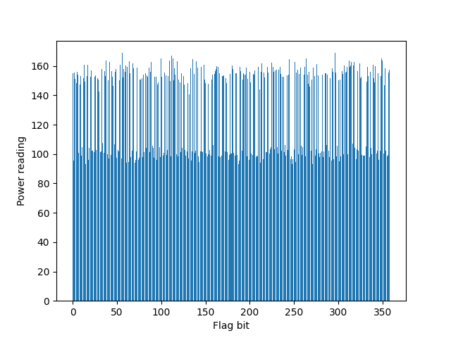

# Double and Broken

A classic example in timing/power analysis of multiplication algorithms. This boils down to how the `double-and-add` algorithm is implemented, and bears great resemblance to the `square-and-multiply` method. The following is the pseudocode for the algorithm of computing $sP$, where $P$ is the given point and $s$ is the number we want to multiply.

```python
let bits = bit_representation(s) # the vector of bits (from LSB to MSB) representing s
let res = O # point at infinity
let temp = P # track doubled P value 
for bit in bits:
    if bit == 1:
        res = res + temp # point add
    temp = temp + temp
return res
```

We can clearly see that if the `if` branch is taken, an additional addition step is taken. Hence this leads to a longer time running for the iteration, or more power consumed (as some power needs to be spent on the addition). We thus can perform some side-channel analysis on the running time of each iteration. This is a [good blog post](https://circuitcellar.com/research-design-hub/design-solutions/power-analysis-of-ecc-hardware-implementations/) outlining this attack.

This challenge is a bit easier, we are given the timing for each of the bits in the binary representation of the flag. Our task is to perform the side channel analysis on the runtime of each iteration, or flag bit that is currently processing. Since we are given 50 observations, we can take the mean of all the observations given and generate a plot to see the trend.

<p align="center">
  
</p>

We can clearly see the two groups of values here, the group representing the `0` bit should be the ones having the power readings lower than 120, and the rest for the `1` bit. Some sorting might be useful if the graph is a bit too dense, but this should illustrate the point. 

From this observation, we can have a simple script to retrieve the value of every bit in the flag.

Python Implementation: 

```python
from Crypto.Util.number import long_to_bytes
import json 
import numpy as np
import matplotlib.pyplot as plt

f = open('output.txt', 'r')
readings = np.array(json.loads(f.readline()))

# Means across 50 observations
readings = np.mean(readings, axis=0)
index = list(range(len(readings)))

# Generate the graph
# plt.bar(index, readings)
# plt.xlabel("Flag bit")
# plt.ylabel("Power reading")
# plt.savefig('readings.png')

# Retrieve the output from the readings
output = ""
for reading in readings:
    if reading < 120:
        output += "0"
    else:
        output += "1"

# Has to reverse the output string
# 2 ways to implement double-and-add, either LSB to MSB, or MSB to LSB
flag = int(output[::-1], 2)
print(long_to_bytes(flag))
```