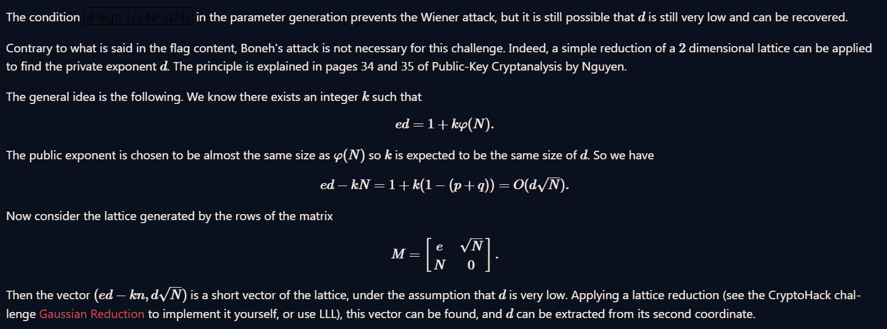

# Everything is still Big

Same problem as the previous similar name challenge. But there is a twist this time. There is a check of `(3*d)**4 > N`, which effectively renders Weiner's attack useless.

We can use [Boneh-Durfee Attack](https://cryptohack.gitbook.io/cryptobook/untitled/low-private-component-attacks/boneh-durfee-attack). Awesome script at this [link](https://github.com/mimoo/RSA-and-LLL-attacks/blob/master/boneh_durfee.sage). The [Github repo](https://github.com/mimoo/RSA-and-LLL-attacks) contains some useful scripts. 

Boneh-Durfee Attack limit: 

$$
d < N ^ {0.292}
$$

From the retrieved `d`, we can easily recover the plaintext. 

Seems like there is another solution by `aloof`, which I am too lazy to type so here's the screenshot of the math involved.



Sage Implementation:

```python
N = ...
e = ...
c = ...
s = floor(sqrt(N))
M = Matrix([[e, s], [N, 0]])
Mred = M.LLL()
D = [abs(Mred[i, 1]) // s for i in [0,1]]

for d in D:
    t = randint(2, N - 2)
    tt = pow(t, e, N)
    if tt^d != t:
        continue
    flag = int(pow(c, d, N))
    flag = flag.to_bytes((flag.bit_length() + 7)//8, 'big')
    print(f'FLAG: {flag.decode()}')
```