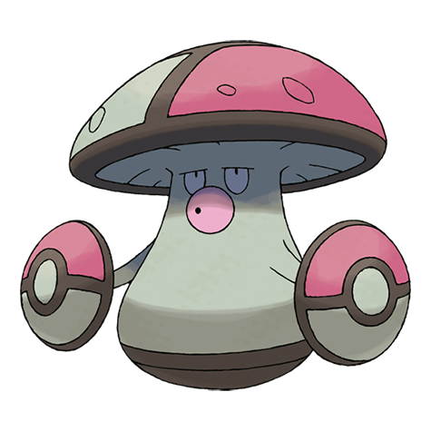
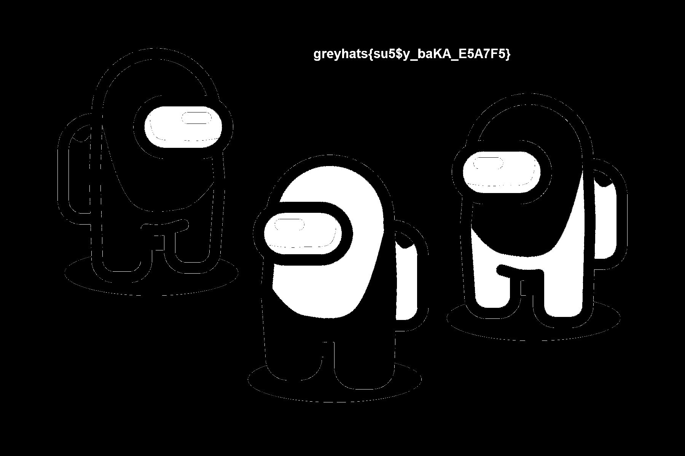

# AmongUs



This is a challenge involving image steganography. Not so difficult if you know the proper tooling for the challenge. 
[AperiSolve](https://www.aperisolve.com/) should give a full overview of the file and make it trivial to solve this challenge. 

A good list to consider for steganography challenges is this list of useful tools and resources for steganography by [0xRick](https://0xrick.github.io/lists/stego/). [Hacktricks](https://book.hacktricks.xyz/crypto-and-stego/stego-tricks) also provides a great list of tools to try out.

I did not know `AperiSolve` beforehand, so solving this was a bit painful. After a bit of fiddling with `zsteg` and other tooling for image steganography on `Kali Linux`, I encountered the first tool needed for the challenge: [foremost](https://github.com/korczis/foremost). `binwalk` achieves the same - but the output is a bit messy. After running `foremost` on the image given, we obtain the following output: 

```
Foremost version 1.5.7 by Jesse Kornblum, Kris Kendall, and Nick Mikus
Audit File

Foremost started at Sat Aug 20 03:54:12 2022
Invocation: foremost -v amoonguss.png 
Output directory: /home/kali/WelcomeCTF/AmongUs/output
Configuration file: /etc/foremost.conf
------------------------------------------------------------------
File: amoonguss.png
Start: Sat Aug 20 03:54:12 2022
Length: 237 KB (243493 bytes)
 
Num	 Name (bs=512)	       Size	 File Offset	 Comment 

0:	00000000.png 	     152 KB 	          0 	  (475 x 475)
1:	00000305.png 	      85 KB 	     156264 	  (1800 x 1200)
Finish: Sat Aug 20 03:54:12 2022

2 FILES EXTRACTED
	
png:= 2
------------------------------------------------------------------

Foremost finished at Sat Aug 20 03:54:12 2022
```

The tool has found another image inside the original image. This image somewhat fits the title of the challenge.


Again, after a while of messing with image stegano tools, I eventually found out the solution of the problem. Looking at the Red channel of the image, we should be able see a hidden message - the flag of the challenge.

