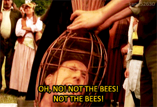
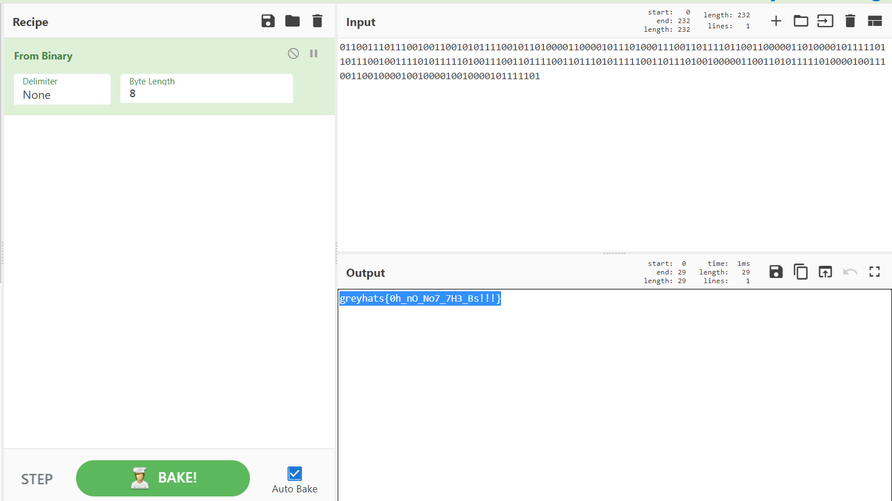

# B 



A interesting challenge. We were provided with a `GIF` of Nicholas Cage suffering from bees. Title of the challenge is also `B` - so something has to do with the letter B. Only the `GIF` is provided, hence this challenge should be a steganography challenge. 

Using the steganography tools for `GIF` does not return any usable data. But, when we look at the end of the output from the `hexdump` of the `GIF`, we can see something promising

```shell
001e9e00  3b bb 42 42 bb bb 42 42  42 bb 42 42 42 bb bb 42  |;.BB..BBB.BBB..B|
001e9e10  bb bb 42 42 bb bb 42 bb  42 bb 42 42 42 42 bb bb  |..BB..B.B.BBBB..|
001e9e20  42 bb 42 42 bb 42 bb bb  bb bb 42 42 bb bb bb bb  |B.BB.B....BB....|
001e9e30  42 bb 42 42 42 bb 42 bb  bb bb 42 42 42 bb bb 42  |B.BBB.B...BBB..B|
001e9e40  42 bb 42 42 42 42 bb 42  42 bb bb 42 42 bb bb bb  |B.BBBB.BB..BB...|
001e9e50  bb bb 42 42 bb 42 bb bb  bb bb 42 bb 42 42 42 42  |..BB.B....B.BBBB|
001e9e60  42 bb 42 42 bb 42 42 42  bb bb 42 bb bb 42 42 42  |B.BB.BBB..B..BBB|
001e9e70  42 bb 42 bb 42 42 42 42  42 bb 42 bb bb 42 42 42  |B.B.BBBBB.B..BBB|
001e9e80  bb bb 42 42 bb 42 42 42  42 bb bb 42 42 bb 42 42  |..BB.BBBB..BB.BB|
001e9e90  42 bb 42 bb 42 42 42 42  42 bb bb 42 42 bb 42 42  |B.B.BBBBB..BB.BB|
001e9ea0  42 bb 42 bb bb 42 bb bb  bb bb bb 42 42 bb bb 42  |B.B..B.....BB..B|
001e9eb0  42 bb 42 bb 42 42 42 42  42 bb 42 bb bb bb bb 42  |B.B.BBBBB.B....B|
001e9ec0  bb bb 42 42 42 bb bb 42  42 bb bb 42 bb bb bb bb  |..BBB..BB..B....|
001e9ed0  42 bb bb 42 bb bb bb bb  42 bb bb 42 bb bb bb bb  |B..B....B..B....|
001e9ee0  42 bb 42 42 42 42 42 bb  42                       |B.BBBBB.B|
001e9ee9
```

Seems like the letter `B` (with hex value `42`), and the character `.` (with hex value `bb`) is alternating back and forth in the last bytes of the `GIF`. This may suggest a binary string. A supposition we may have is that the character `.` may represent the value `1` and the character `B` may represent the value `0` in a binary string. If this does not provide any promising data, then we flip the value that each character represents.

Hence, from the above supposition, we obtain the following binary string:

```
0110011101110010011001010111100101101000011000010111010001110011011110110011000001101000010111110110111001001111010111110100111001101111001101110101111100110111010010000011001101011111010000100111001100100001001000010010000101111101
```

Putting this to [CyberChef](https://gchq.github.io/CyberChef/), we luckily found something meaningful - the flag itself.

