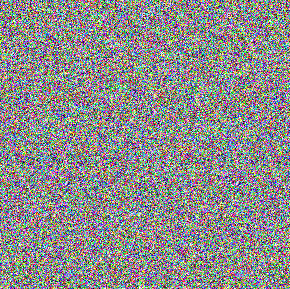
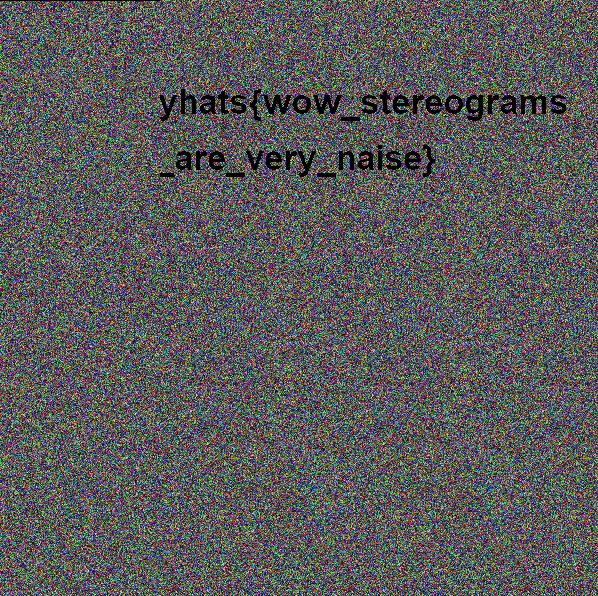

# Grains

A static-like image is given in the challenge. There is no information using `AperiSolve` and `binwalk`, or some image steganography techniques sometimes used in CTF like LSB steganography. 

I did not solve this and only know the solution from looking at the chats of WelcomeCTF. This is a stereogram - commonly used for visual effect by deceiving the eye into thinking there is a 3D object created from overlaying two random pieces of colored pages.

The tool to solve this is [magiceye](https://magiceye.ecksdee.co.uk/). Dragging the image around a bit and we should be able to see the flag. 

