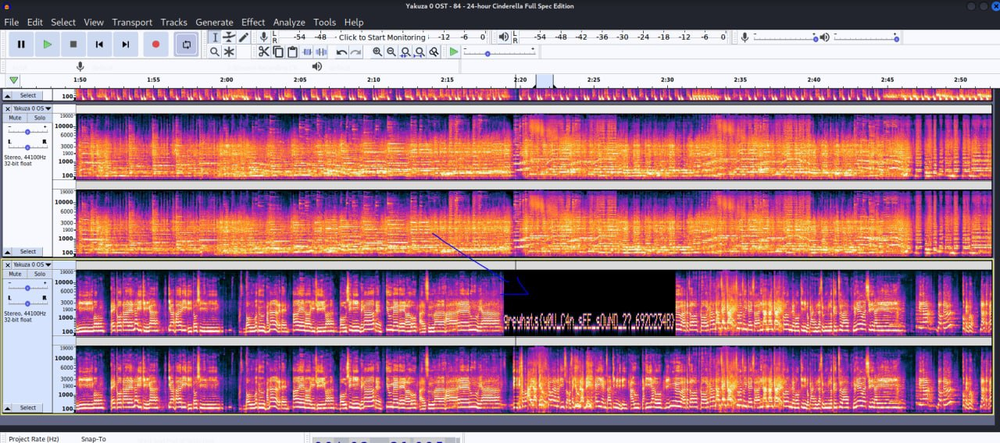

# Multitrack Drifting

We are given a soundtrack of the famous `Yakuza 0` game. Only the soundtrack is given, and with a file with the extension of `.aup`. Looking up the program associated with the file shows the result of [Audacity](https://www.audacityteam.org/). 

Putting the given `.aup` file to Audacity and open the spectrogram, then configuring the color and the timescale of the software, we should be able to see the text representation of the flag.

