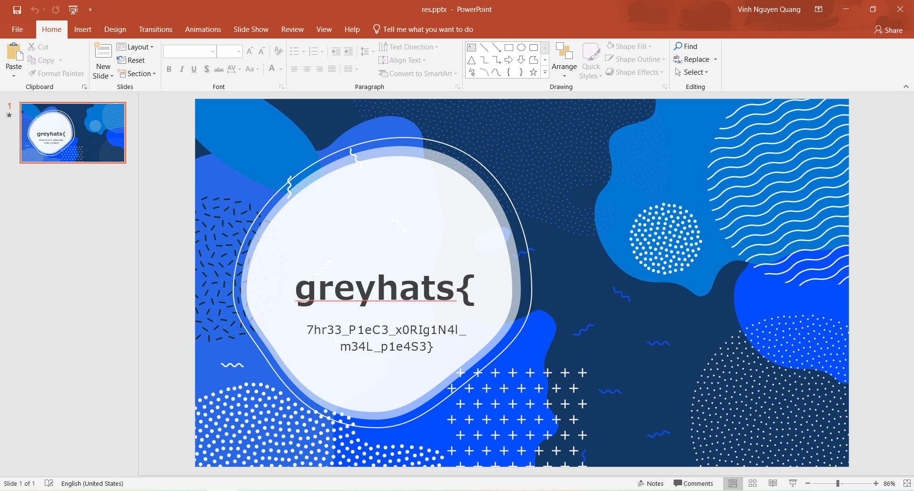

# Triple

We notice that the size of the three files given `1`, `2`, `3` and `flag.pptx` is the same. And since the challenge is in the `crypto` category, a guess for how we can solve this challenge is through the use of `xor`-ing the files given.

A Python script can be written to `xor` the files, but I was too lazy to do so. Hence, I found [xor-files](https://github.com/scangeo/xor-files), a tool for `XOR` for two or more files and get the result on a pipe.

We will `XOR` the files that is given by the challenge, and the output after redirecting to a file and calling the command `file` on the resultant file should tell us that it is a PowerPoint 2007+ file. 

