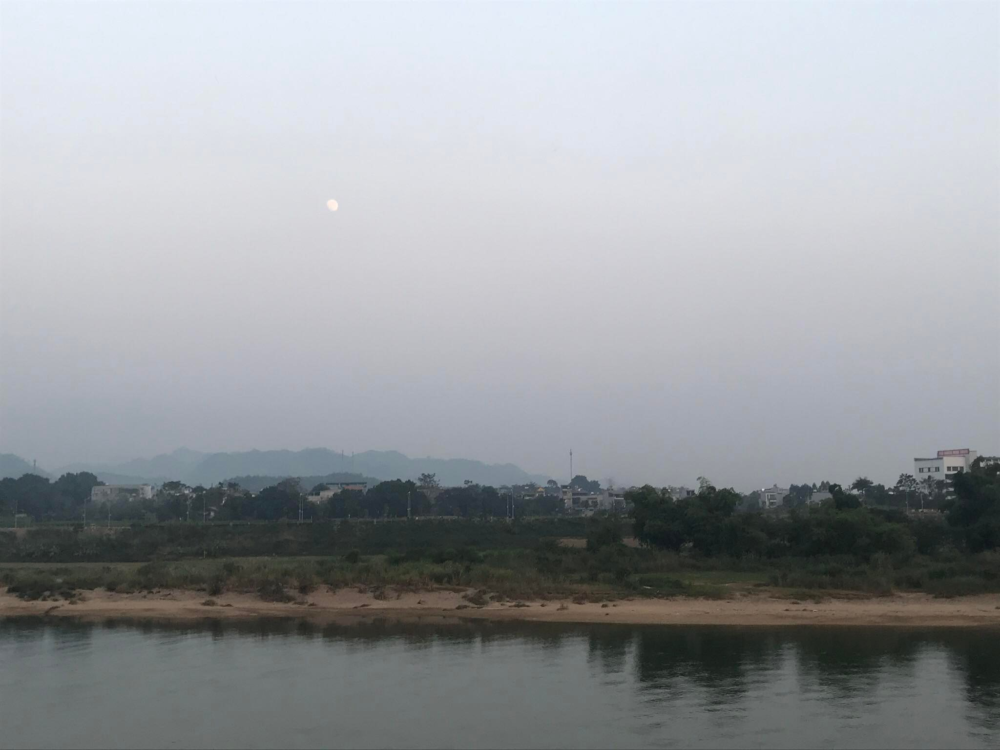
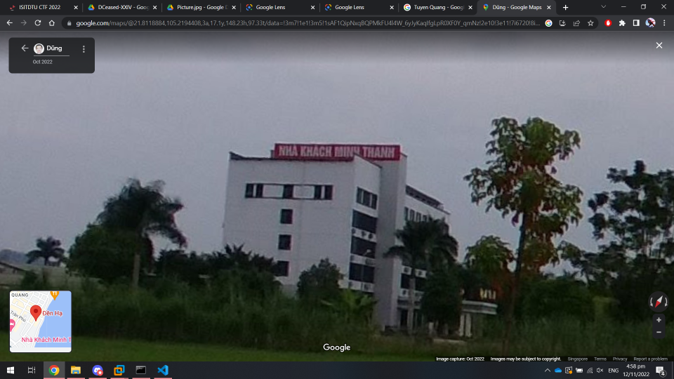

# Find

A tough OSINT challenge. Initially we are only given the following image.

There was initially no clues given by the challenge organizer. We did locate something in the right corner of the challenge image that is useful somewhat for finding the location of the place - the `motel`, or in Vietnamese `nha khach`. Unfortunately I am not so sure what follows afterwards, `giao thong` is a guess I made, but in the end it turned out to be wrong. The location associated with the name of `nha khach giao thong` is not in the countryside area, and mostly in the urban regions.

We do know from our sixth sense that the place is in Viet Nam - the fauna and the river bank strongly suggests a Vietnamese location.

Afterwards, a hint of `a famous place in Tuyen Quang` is given out. It is sensible just to brute-force the solution at this point - this clue was basically giving out the solution to the challenge itself. In the end, the place that the picture was taken is at "Den Ha, Tuyen Quang" - which indeed is a famous place. We did manage to find the exact spot on Google Maps where the image was taken. The Google Maps link for "Den Ha" is at this [link](https://www.google.com/maps/place/%C4%90%E1%BB%81n+H%E1%BA%A1/@21.8128524,105.2161269,16z/data=!4m5!3m4!1s0x3134adfeffcc4099:0xb4faa0f0c963d8b!8m2!3d21.8129657!4d105.2150063)

